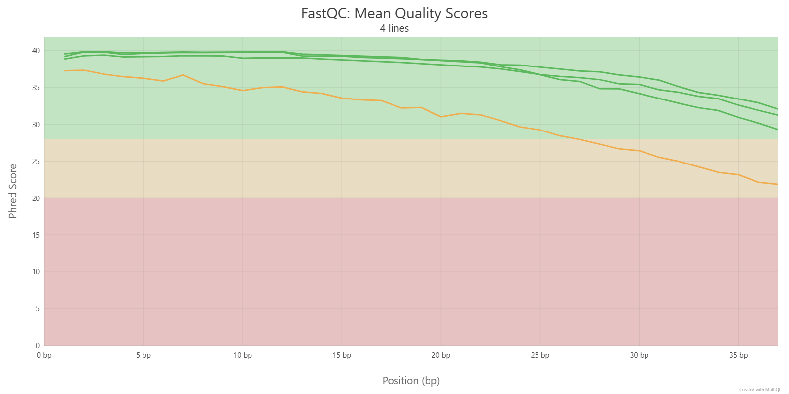
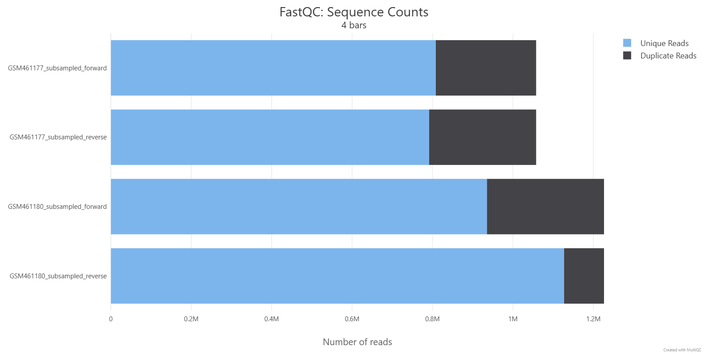
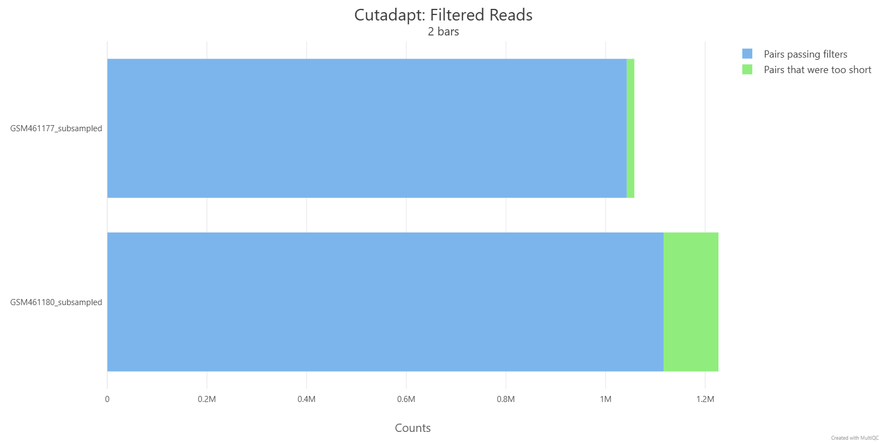
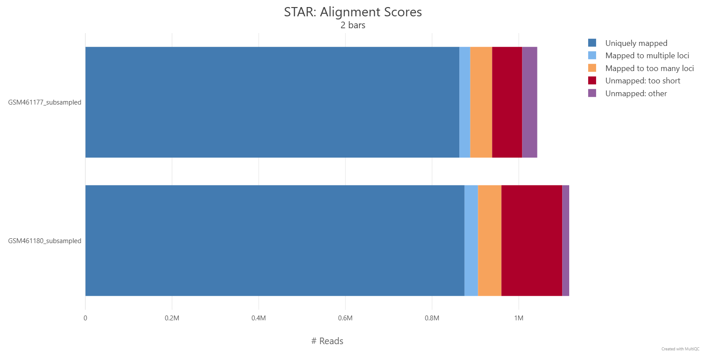
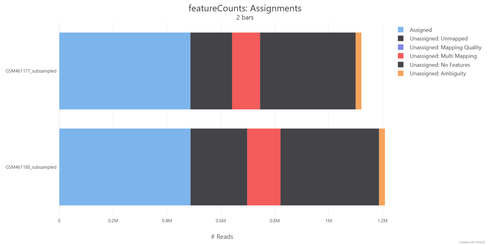

# RNA-Seq Reference-Based Analysis

> A complete, reproducible RNA-Seq differential expression pipeline executed on [Galaxy Europe](https://usegalaxy.eu), analyzing the transcriptomic response to drug treatment in *Drosophila melanogaster* (dm6).


-orange)


---

## Table of Contents

- [Overview](#overview)
- [Biological Context](#biological-context)
- [Pipeline Architecture](#pipeline-architecture)
- [Repository Structure](#repository-structure)
- [Data](#data)
- [Methodology](#methodology)
  - [1. Quality Control](#1-quality-control)
  - [2. Read Trimming](#2-read-trimming)
  - [3. Splice-Aware Alignment](#3-splice-aware-alignment)
  - [4. Read Quantification](#4-read-quantification)
  - [5. Differential Expression Analysis](#5-differential-expression-analysis)
  - [6. Functional Enrichment](#6-functional-enrichment)
- [Key Results](#key-results)
- [Tool Versions](#tool-versions)
- [Reproducing the Analysis](#reproducing-the-analysis)
- [References](#references)
- [License](#license)

---

## Overview

This project implements a standard reference-based RNA-Seq analysis workflow to identify genes that are differentially expressed between **treated** and **untreated** *Drosophila melanogaster* samples. The pipeline spans raw FASTQ quality control through functional enrichment of significant genes, and was executed entirely on the [Galaxy Europe](https://usegalaxy.eu) platform, requiring no local software installation.

The analysis processes 7 samples (3 treated, 4 untreated) and identifies **113 differentially expressed genes** (adjusted p-value < 0.05, |log2 fold-change| > 1).

---

## Biological Context

RNA-Seq measures gene expression by sequencing messenger RNA (mRNA) molecules extracted from cells. Since mRNA is produced from DNA through transcription, the abundance of a gene's mRNA reflects how actively that gene is being expressed. By comparing mRNA levels between experimental conditions (e.g., treated vs. untreated), we can identify which genes respond to the treatment.

Because RNA-Seq reads come from processed mRNA (introns removed), mapping them back to the genome requires a **splice-aware aligner** like STAR that can handle reads spanning exon-exon junctions.

```
Genome:   ===EXON1=========[INTRON]=========EXON2===
mRNA:     ===EXON1==============================EXON2===
Read:                    ←—— read spans junction ——→
```

---

## Pipeline Architecture

```
FASTQ reads
    │
    ▼
┌─────────────────────┐
│  1. Quality Control  │  Falco + MultiQC
│     (FastQC metrics) │
└─────────┬───────────┘
          ▼
┌─────────────────────┐
│  2. Read Trimming    │  Cutadapt
│     (Phred ≥ 20)     │
└─────────┬───────────┘
          ▼
┌─────────────────────┐
│  3. Alignment        │  RNA STAR (splice-aware)
│     (dm6 genome)     │
└─────────┬───────────┘
          ▼
┌─────────────────────┐
│  4. Quantification   │  featureCounts
│     (gene counts)    │
└─────────┬───────────┘
          ▼
┌─────────────────────┐
│  5. Differential     │  DESeq2
│     Expression       │  (treated vs. untreated)
└─────────┬───────────┘
          ▼
┌─────────────────────┐
│  6. Functional       │  goseq
│     Enrichment       │  (GO terms + KEGG)
└─────────────────────┘
```

---

## Repository Structure

```
RNA-Seq-Reference-Based-Analysis/
│
├── README.md                          # This file
├── LICENSE                            # MIT License
├── .gitignore                         # Git ignore rules
├── environment.yml                    # Tool versions (Galaxy platform)
│
├── data/
│   └── links.txt                      # Zenodo download URLs for all input data
│
├── docs/
│   └── methodology.md                 # Detailed step-by-step Galaxy instructions
│
├── results/
│   ├── 01-quality-control/            # FastQC / Falco / Cutadapt MultiQC plots
│   │   ├── fastqc_per_base_sequence_quality.png
│   │   ├── fastqc_per_sequence_quality_scores.png
│   │   ├── fastqc_per_base_sequence_content.png
│   │   ├── fastqc_per_sequence_gc_content.png
│   │   ├── fastqc_per_base_n_content.png
│   │   ├── fastqc_sequence_duplication_levels.png
│   │   ├── fastqc_sequence_counts.png
│   │   ├── cutadapt_filtered_reads.png
│   │   └── general_stats_table.png
│   │
│   ├── 02-alignment/                  # STAR alignment MultiQC plots
│   │   ├── star_alignment_scores.png
│   │   ├── star_summary_table.png
│   │   ├── general_stats_table.png
│   │   └── table_scatter_plot.png
│   │
│   ├── 03-quantification/            # featureCounts MultiQC plots
│   │   ├── featurecounts_assignment.png
│   │   ├── general_stats_table.png
│   │   └── table_scatter_plot.png
│   │
│   └── 04-differential-expression/   # DESeq2, heatmaps, GO enrichment
│       ├── deseq2_plots.pdf
│       ├── heatmap_normalized.pdf
│       ├── heatmap_zscore.pdf
│       └── go_terms_enrichment.pdf
│
└── scripts/                           # (placeholder for custom scripts)
```

---

## Data

All input data is publicly hosted on [Zenodo](https://zenodo.org/record/6457007) and can be imported directly into Galaxy. The dataset originates from a study of drug-treated vs. untreated *Drosophila melanogaster* cell cultures.

### Samples

| GEO Accession | Condition | Library Layout | Used In |
|----------------|-----------|----------------|---------|
| GSM461176 | Untreated | Single-end | DESeq2 |
| GSM461177 | Untreated | Paired-end | Full pipeline + DESeq2 |
| GSM461178 | Untreated | Paired-end | DESeq2 |
| GSM461179 | Treated | Single-end | DESeq2 |
| GSM461180 | Treated | Paired-end | Full pipeline + DESeq2 |
| GSM461181 | Treated | Paired-end | DESeq2 |
| GSM461182 | Untreated | Single-end | DESeq2 |

Subsampled FASTQ files (~5 MB each) for GSM461177 and GSM461180 are used for the QC-to-counting portion of the pipeline. Pre-computed count files for all 7 samples are used for the DESeq2 differential expression analysis.

Download links for all files are listed in [`data/links.txt`](data/links.txt).

### Reference Genome

- **Species**: *Drosophila melanogaster*
- **Assembly**: dm6 (BDGP Release 6 + ISO1 MT)
- **Annotation**: Ensembl release 109 (UCSC chromosome naming)

---

## Methodology

A detailed, step-by-step Galaxy walkthrough with exact tool parameters is provided in [`docs/methodology.md`](docs/methodology.md). Below is a summary of each stage.

### 1. Quality Control

Raw paired-end FASTQ reads are assessed with **Falco** (a FastQC-compatible tool) and aggregated via **MultiQC**. Metrics evaluated include per-base sequence quality, GC content distribution, sequence duplication levels, and adapter contamination.

<p align="center">
  
</p>
<p align="center"><em>Per-base sequence quality scores across all samples. Green zone indicates Phred >= 28 (high quality).</em></p>

<p align="center">
  
</p>
<p align="center"><em>Sequence count distribution showing total reads per sample.</em></p>

### 2. Read Trimming

**Cutadapt** removes low-quality bases (Phred < 20) from read ends and discards reads shorter than 20 bp. Paired-end mode ensures that if either mate is dropped, both are removed to maintain proper pairing.

<p align="center">
  
</p>
<p align="center"><em>Cutadapt read filtering summary — proportion of reads passing quality and length filters.</em></p>

### 3. Splice-Aware Alignment

Trimmed reads are mapped to the dm6 reference genome using **RNA STAR**, a splice-aware aligner. STAR detects reads that span exon-exon junctions and aligns them correctly across introns. The sjdbOverhang parameter is set to 36 (read length 37 - 1).

<p align="center">
  
</p>
<p align="center"><em>STAR alignment statistics — the majority of reads are uniquely mapped (blue).</em></p>

### 4. Read Quantification

**featureCounts** assigns mapped reads to genomic features (exons) using the Ensembl GTF annotation. Only reads with mapping quality >= 10 are counted. Paired-end fragments are counted once per pair.

<p align="center">
  
</p>
<p align="center"><em>featureCounts read assignment summary — blue shows successfully assigned reads.</em></p>

### 5. Differential Expression Analysis

**DESeq2** performs normalization and statistical testing on the 7-sample count matrix. Two factors are modeled:

1. **Treatment** (treated vs. untreated) — the factor of interest
2. **Sequencing** (paired-end vs. single-end) — a confounding batch variable

Genes are filtered using:
- Adjusted p-value < 0.05 (Benjamini-Hochberg correction)
- |log2 fold-change| > 1 (fold change > 2)

This yields **113 differentially expressed genes**.

DESeq2 diagnostic plots (PCA, MA plot, dispersion estimates, sample distance heatmap) are available in [`results/04-differential-expression/deseq2_plots.pdf`](results/04-differential-expression/deseq2_plots.pdf).

Expression heatmaps of the significant genes are available as:
- [Normalized counts heatmap](results/04-differential-expression/heatmap_normalized.pdf) — log2-transformed expression values
- [Z-score heatmap](results/04-differential-expression/heatmap_zscore.pdf) — row-standardized to highlight relative changes

### 6. Functional Enrichment

**goseq** performs Gene Ontology (GO) enrichment analysis to identify overrepresented biological processes, molecular functions, and cellular components among the 113 DEGs. KEGG pathway analysis is also conducted separately.

The enrichment analysis accounts for gene-length bias, which is a known confound in RNA-Seq data — longer genes have more statistical power to be detected as differentially expressed.

Results are available in [`results/04-differential-expression/go_terms_enrichment.pdf`](results/04-differential-expression/go_terms_enrichment.pdf).

---

## Key Results

| Metric | Value |
|--------|-------|
| Total samples | 7 (3 treated + 4 untreated) |
| Subsampled reads per sample | ~1 M paired-end reads |
| Uniquely mapped reads | ~83-85% |
| Reads assigned to genes | ~50-55% |
| Total genes tested | ~17,000 |
| Significant DEGs (padj < 0.05, \|log2FC\| > 1) | 113 |

---

## Tool Versions

All tools were executed on [Galaxy Europe](https://usegalaxy.eu). Complete version information is in [`environment.yml`](environment.yml).

| Step | Tool | Version |
|------|------|---------|
| Quality assessment | Falco | 1.2.4 |
| Report aggregation | MultiQC | 1.27 |
| Read trimming | Cutadapt | 5.2 |
| Splice-aware alignment | RNA STAR | 2.7.11b |
| Read counting | featureCounts | 2.1.1 |
| Differential expression | DESeq2 | 2.11.40.8 |
| Visualization | heatmap2 | 3.2.0 |
| GO / KEGG enrichment | goseq | 1.50.0 |

---

## Reproducing the Analysis

1. Create a free account on [Galaxy Europe](https://usegalaxy.eu).
2. Import input data using the URLs in [`data/links.txt`](data/links.txt).
3. Follow the step-by-step instructions in [`docs/methodology.md`](docs/methodology.md).

No local software installation is required — everything runs in the browser.

---

## References

- **Galaxy Platform**: Afgan, E. et al. (2018). The Galaxy platform for accessible, reproducible and collaborative biomedical analyses. *Nucleic Acids Research*, 46(W1), W537-W544.
- **STAR Aligner**: Dobin, A. et al. (2013). STAR: ultrafast universal RNA-seq aligner. *Bioinformatics*, 29(1), 15-21.
- **DESeq2**: Love, M.I. et al. (2014). Moderated estimation of fold change and dispersion for RNA-seq data with DESeq2. *Genome Biology*, 15, 550.
- **featureCounts**: Liao, Y. et al. (2014). featureCounts: an efficient general purpose program for assigning sequence reads to genomic features. *Bioinformatics*, 30(7), 923-930.
- **goseq**: Young, M.D. et al. (2010). Gene ontology analysis for RNA-seq: accounting for selection bias. *Genome Biology*, 11, R14.
- **Cutadapt**: Martin, M. (2011). Cutadapt removes adapter sequences from high-throughput sequencing reads. *EMBnet.journal*, 17(1), 10-12.
- **Galaxy Training**: Batut, B. et al. (2018). Community-Driven Data Analysis Training for Biology. *Cell Systems*, 6(6), 752-758.

---

## License

This project is licensed under the MIT License — see the [LICENSE](LICENSE) file for details.
